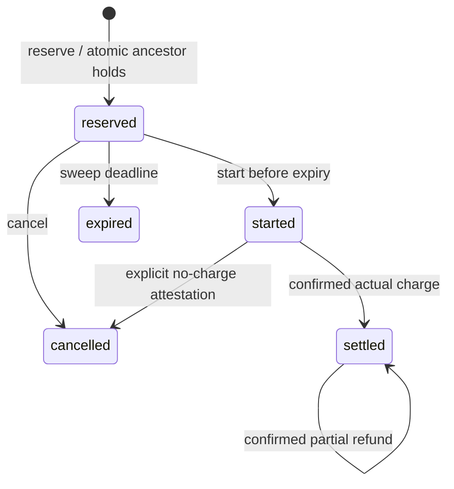

# Operational contract

## State machine



For an account, `spent` includes all net settled descendant costs; `held` includes
all reserved and started descendant estimates. `available = ceiling - spent - held`.
Parents can also be charged directly. A child ceiling may exceed its parent's;
the effective ceiling is still the tightest remaining ancestor capacity.

Every operation creates a fresh connection, enables foreign keys and FULL
synchronous writes, begins an immediate transaction, updates all projections,
appends a receipt and persists its idempotent response, then commits. A lock timeout,
disk-full error or failed statement raises rather than returning an allowed permit.
The caller must treat every exception as no authorization. An uncertain commit
can be resolved by retrying exactly the same durable operation key.

There is no remote I/O inside transactions. A start claim prevents two compliant
workers from dispatching one permit. It does not establish exactly-once execution
at a remote provider: persist a provider request key and query provider outcome
after an ambiguous timeout. Unresolved started work remains held indefinitely.
Do not release it just to restore availability. For a known zero-cost failure,
settle actual 0, or cancel with `no_charge=True`.

Amounts and timestamps range from 0 through 2^63−1, with strictly positive holds,
refunds and TTLs. Bool, floating point, infinity and NaN are rejected. An aggregate
that exceeds SQLite's integer range fails atomically and preserves its unresolved
hold for operator recovery; split an unreasonable accounting lifetime into scopes.
Currencies are three uppercase letters treated as labels, never converted.

Keys are global to the database, max 200 characters. Failed budget admissions
are durably idempotent; use a new key for an intentional later attempt. Invalid
state/validation errors do not consume a key. Account creation is idempotent by
name and exact configuration. Account limits and ancestry are immutable in v0.1.

System wall-clock time controls expiry; a backward clock adjustment prolongs an
undispatched hold, while a forward jump can expire it early. This cannot release
started work. `clock=` exists for deterministic testing, not client-supplied time.

## Integrity and retention

Each receipt hashes its sequence, timestamp, previous digest and canonical JSON
body. Its body contains operation arguments, result and affected row snapshots.
`verify()` checks the chain, replays the state machine from an empty ledger, checks
every intermediate receipt snapshot against the independently reconstructed
balances, and compares the final accounts, reservations and idempotency cache
with the database in one consistent read snapshot. A later ordinary operation
cannot conceal an earlier manually edited balance by writing a new snapshot.
Keep `verify()['checkpoint']` in separate protected storage. Pass it to
`verify(checkpoint=...)` or CLI `verify --checkpoint checkpoint.json` on a later
copy. An older checkpoint allows a longer history but rejects truncation below it.

For an offline reconciliation copy, export `ledger.receipts()` to UTF-8 JSON and
call `verify_receipts(exported, checkpoint=retained_checkpoint)` from the SDK, or
run `python -m agentledger verify-receipts receipts.json --checkpoint checkpoint.json`.
The offline command opens no SQLite file and verifies the same transitions and
intermediate conservation rules. The checkpoint must contain exactly `seq`
(nonnegative integer, not bool) and `digest` (lowercase SHA-256 hex); retain it
independently before a dispute. A self-consistent history rewritten before an
untrusted checkpoint does not prove authenticity.

中文：可导出 UTF-8 JSON 收据，在没有数据库的环境逐条复算预占、开始、结算、退款和
过期转换。复算同时检查每层余额，避免“最后一张快照正确”掩盖早期错误；外部保存的
检查点用于发现历史截断或重写，不能证明提供商收费本身真实。

The chain establishes consistency, not provider truth or signer identity. Local
OS access is the trust boundary. Direct SQL changes bypass the SDK. Never place
credentials, prompts, PII or payloads in operation keys/account names. There is no
pruning API: budget capacity and receipt retention are different responsibilities.
For backup, quiesce all writers and copy the database, or use SQLite's online
backup API; copying a live `.db` file without its WAL is unsafe.

## Complexity and failure boundary

For hierarchy depth `d`, a new budget transition checks/updates `O(d)` account
rows and writes one receipt, permit and/or cache row. Expiration adds one such
transition for every expired undispatched permit. Account lookups and expiry
selection use SQLite indexes; transaction lock waiting is bounded by `timeout`.
A cached retry scans receipts in reverse order, worst-case `O(n)` receipts.
Full verification takes `O(n*d)` replay work and stores `O(a+r+k)` reconstructed
accounts, permits and operation keys. Offline JSON import also holds the input
list in memory; the CLI limits each JSON file to 16 MiB. There is no receipt
pruning or fixed-size live-ledger claim. The local benchmark measures depth 2.

The tests interrupt a real child process before and after commit, race threads
and spawned processes, independently sum descendant charges/holds, and audit
rehashed contradictory snapshots. They do not simulate power-loss behavior of
every storage device, establish remote exactly-once effects, or turn an externally
edited database into a trusted admission source. After restore or direct SQL
maintenance, verify against a protected checkpoint before resuming workers.

## Replay input

```json
{
  "currency": "USD",
  "tenant_limit": 10000,
  "sessions": {"research": 8000, "coding": 8000},
  "batches": [
    [
      {"id": "search-1", "session": "research", "estimate": 6000, "actual": 5000},
      {"id": "render-1", "session": "coding", "estimate": 6000, "actual": 4500}
    ]
  ]
}
```

IDs must be unique across batches. Input is bounded to 1000 sessions, 1000 batches and 10000 calls;
the CLI accepts at most 16 MiB of UTF-8 JSON, with an optional BOM. Unknown fields
are errors, so a misspelled policy setting cannot be silently ignored. Call IDs
and session names allow 200 characters; internal keys use distinct operation
namespaces and fixed-length SHA-256 encodings to avoid accidental collisions.

All admissions in a batch precede all its
settlements. The hierarchical policy uses the real SDK; session-only ablates
parent links but keeps reservations. Post-hoc checks only already reported spend
against tenant and session limits, so an overlapping batch can overrun them.
Neither baseline emulates LiteLLM or OpenMeter. Declaring actuals above estimates
can falsify the hard-bound premise; the report displays resulting overspend.
Actual values for denied work are counterfactual input, not observations. Policy
admission order follows input order; it is not a throughput optimizer or fairness
scheduler.
